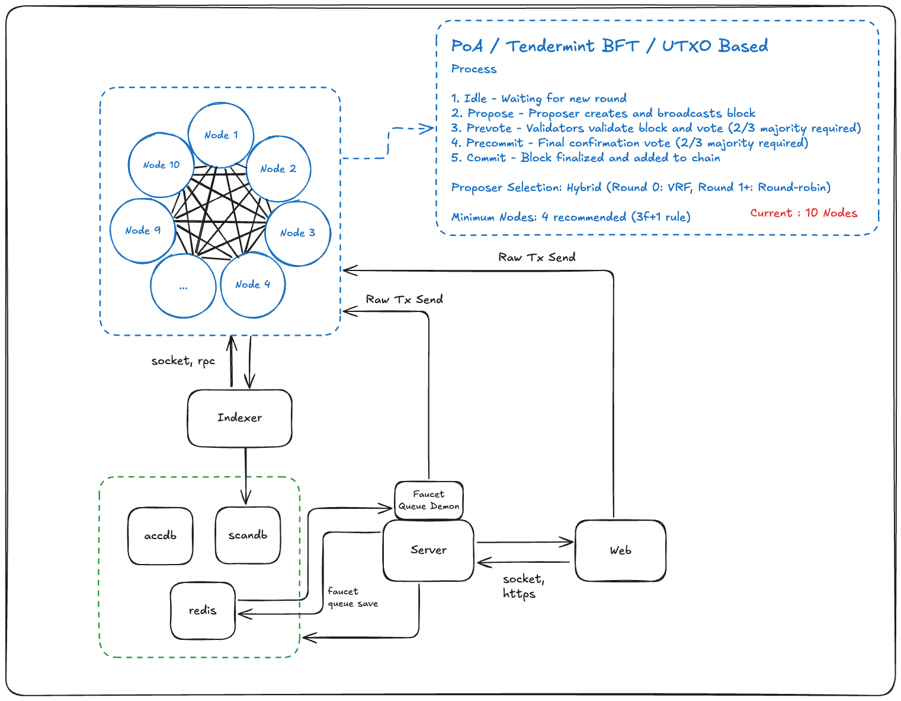

<p align="center">
  <h1 align="center">ABCFE Node</h1>
  <p align="center"><b>A Blockchain For Explorer</b></p>
  <p align="center">블록체인 탐험가를 위한 교육용 블록체인 노드</p>
</p>

<p align="center">
  <a href="./LICENSE"></a>
  <a href="https://golang.org"></a>
  <a href="https://abcfe.net"></a>
</p>

---

> **"누구나, 매우 쉽게, 눈으로 확인하고, 체험하며 체득한다."**

---

## What is ABCFE Node?

**ABCFE Node**는 [ABCFE 교육 플랫폼](https://abcfe.net)에 특화된 블록체인 노드입니다. [→ 플랫폼 구조 보기](#abcfe-platform)

블록체인의 모든 과정을 **눈으로 확인**할 수 있도록 설계되었습니다:

```
지갑 생성 → 토큰 수령 → 트랜잭션 생성 → 멤풀 확인 → 블록 구성 → 검증자 투표 → 체인 연결 → 잔액 변경
```

컨센서스의 모든 단계를 실시간으로 관찰하고, 비트코인과 동일한 UTXO 모델로 트랜잭션의 흐름을 이해할 수 있습니다.

---

## Key Features

| 특징 | 설명 |
|------|------|
| **실시간 컨센서스 관찰** | WebSocket으로 5단계 상태 변화를 실시간 스트리밍 |
| **순수 UTXO 모델** | Bitcoin 방식의 트랜잭션 모델 (Script 제거, 핵심만) |
| **BFT 컨센서스** | 검증자 투표 과정을 눈으로 확인 |
| **~10초 블록 사이클** | 각 단계를 관찰할 수 있는 적절한 속도 |
| **즉시 실행** | 한 줄 명령으로 멀티노드 환경 구성 |

---

## How It Works

### Consensus Flow

블록 생성의 **모든 단계**를 실시간으로 관찰할 수 있습니다:

👉 [실시간 네트워크 보기](https://abcfe.net/network)

```
IDLE ──▶ PROPOSING ──▶ PREVOTING ──▶ PRECOMMITTING ──▶ COMMITTING ──▶ IDLE
 1s         2s            voting          voting           2s
            │               │               │               │
            │               │               │               └─ 블록 확정, 체인 연결
            │               │               └─ 2/3+ Precommit 투표
            │               └─ 2/3+ Prevote 투표
            └─ 제안자가 블록 생성
```

**~10초 사이클**로 각 단계를 눈으로 확인할 수 있습니다.

### UTXO Model

비트코인과 동일한 UTXO(Unspent Transaction Output) 모델을 사용합니다. 잔액은 단순한 숫자가 아니라 "소비되지 않은 트랜잭션 출력의 합"으로 계산됩니다. 트랜잭션을 생성할 때 기존 UTXO를 입력으로 사용하고, 새로운 UTXO를 출력으로 생성합니다.

---

## Quick Start

### Single Node (간단 시작)

```bash
# 빌드 + 지갑 + 설정 + 노드 시작 (한 줄로!)
./scripts/start_single.sh

# 백그라운드 실행
./scripts/start_single.sh -d

# DB 초기화 후 시작
./scripts/start_single.sh -f
```

### Multi-Node (PoA 컨센서스)

```bash
# 4개 노드 PoA 컨센서스 시작 (3f+1, f=1)
./scripts/start_poa.sh 4

# 상태 확인
./scripts/check_nodes.sh
```

---

## Technical Specs

### Network

| 항목 | 값 |
|------|-----|
| Network ID | `abcfe-mainnet` |
| Block Cycle | ~10초 |
| Token | ABC |
| Min Fee | 1 ABC |

### Consensus (PoA/BFT)

| 항목 | 값 |
|------|-----|
| 방식 | Proof of Authority + BFT Voting |
| 상태 머신 | 5단계 (IDLE → PROPOSING → PREVOTING → PRECOMMITTING → COMMITTING) |
| Proposing | 2초 |
| Voting | 3초 |
| Committing | 2초 |
| Round Timeout | 20초 |

### Proposer Selection

| 알고리즘 | 특징 |
|----------|------|
| **Round-Robin** | 순차 선출, 예측 가능 |
| **VRF** | 해시 기반, 예측 불가능 |
| **Hybrid** | Round 0은 VRF, 이후 Round-Robin (권장) |

### Cryptography

| 항목 | 값 |
|------|-----|
| 타원곡선 | P-256 (NIST 표준) |
| 서명 | ECDSA |
| 지갑 | HD Wallet (BIP-39, BIP-44) |

---

## API

### REST API

| Port | 용도 | 접근 |
|------|------|------|
| 8000 | Public API | 외부 접근 가능 |
| 8800 | Internal API | localhost만 |

#### Public Endpoints (Port 8000)

| Method | Endpoint | 설명 |
|--------|----------|------|
| GET | `/api/v1/status` | 노드 상태 |
| GET | `/api/v1/blocks` | 블록 목록 (페이징) |
| GET | `/api/v1/block/height/{height}` | 높이로 블록 조회 |
| GET | `/api/v1/block/hash/{hash}` | 해시로 블록 조회 |
| GET | `/api/v1/block/latest` | 최신 블록 조회 |
| GET | `/api/v1/address/{addr}/balance` | 주소 잔액 조회 |
| GET | `/api/v1/address/{addr}/utxo` | 주소 UTXO 조회 |
| POST | `/api/v1/tx/signed` | 서명된 TX 제출 |
| GET | `/api/v1/mempool/list` | 멤풀 상태 |
| GET | `/api/v1/consensus/status` | 컨센서스 상태 |

#### Internal Endpoints (Port 8800)

| Method | Endpoint | 설명 |
|--------|----------|------|
| POST | `/api/v1/tx/send` | 서버 지갑으로 TX 전송 |
| GET | `/api/v1/wallet/accounts` | 지갑 계정 목록 |
| POST | `/api/v1/wallet/account/new` | 새 계정 생성 |
| POST | `/api/v1/block` | 테스트용 블록 생성 |

### WebSocket

```javascript
const ws = new WebSocket('ws://localhost:8000/ws');

ws.onmessage = (event) => {
  const { event: type, data } = JSON.parse(event.data);

  switch(type) {
    case 'consensus_state_change':
      // 컨센서스 상태 변화: IDLE → PROPOSING → PREVOTING → ...
      console.log(`State: ${data.state}, Height: ${data.height}`);
      break;
    case 'new_block':
      // 새 블록 생성
      console.log(`New block at height ${data.height}`);
      break;
    case 'new_transaction':
      // 새 트랜잭션 (멤풀 진입)
      console.log(`New TX: ${data.txId}`);
      break;
  }
};
```

연결 즉시 현재 컨센서스 상태와 최신 블록 정보를 수신합니다.


---

## CLI Commands

빌드 후 `abcfed` 바이너리로 다양한 명령어를 사용할 수 있습니다.

### Node Commands

| 명령어 | 설명 |
|--------|------|
| `./abcfed node start` | 노드 시작 (데몬 모드) |
| `./abcfed node stop` | 노드 중지 |
| `./abcfed node restart` | 노드 재시작 |
| `./abcfed node status` | 노드 상태 확인 |
| `./abcfed node info` | 노드 상세 정보 |

### Wallet Commands

| 명령어 | 설명 |
|--------|------|
| `./abcfed wallet create` | 새 지갑 생성 |
| `./abcfed wallet restore` | 니모닉으로 지갑 복구 |
| `./abcfed wallet list` | 계정 목록 조회 |
| `./abcfed wallet add-account` | 새 계정 추가 |
| `./abcfed wallet show-mnemonic` | 니모닉 문구 표시 |

### Global Flags

| 플래그 | 설명 |
|--------|------|
| `-c, --config` | 설정 파일 경로 |
| `-w, --wallet-dir` | 지갑 디렉토리 경로 (wallet 명령어) |
| `-h, --help` | 도움말 |

---

## Scripts

모든 스크립트는 `scripts/` 폴더에 위치하며, 프로젝트 루트 또는 어디서든 실행 가능합니다.

| 스크립트 | 설명 |
|----------|------|
| `start_single.sh` | 단일 노드 시작 (빌드 + 지갑 + 설정 자동) |
| `start_poa.sh N` | N개 노드 PoA 컨센서스 시작 |
| `check_nodes.sh` | 노드 상태 확인 |
| `stop_all_nodes.sh` | 모든 노드 중지 |
| `clean_all.sh` | DB/로그 초기화 (지갑 유지) |
| `resume_poa.sh` | PoA 노드 재시작 (DB 유지) |

### Multi-Node Setup

| Node | Mode | P2P | REST | Role |
|------|------|-----|------|------|
| Node 1 | boot | 30303 | 8000/8800 | Genesis, Block Producer |
| Node 2+ | validator | 30304+ | 8001+/8801+ | Sync, Validation |

```bash
start_poa.sh 4      # 4개 노드 PoA 시작 (3f+1, f=1)
start_poa.sh 7      # 7개 노드 (f=2)
check_nodes.sh      # 상태 확인
stop_all_nodes.sh   # 중지
clean_all.sh        # 초기화
```

---

## Documentation

### 주요 문서

| 문서 | 설명 |
|------|------|
| [CLAUDE.md](CLAUDE.md) | 개발자 가이드 (아키텍처, 코드 구조) |
| [docs/QUICK_START.md](docs/QUICK_START.md) | 빠른 시작 가이드 |
| [docs/USER_GUIDE.md](docs/USER_GUIDE.md) | 전체 사용자 가이드 |
| [docs/TX_GUIDE.md](docs/TX_GUIDE.md) | 트랜잭션 서명 가이드 |

### 상세 문서

| 문서 | 설명 |
|------|------|
| [docs/consensus/](docs/consensus/) | BFT 컨센서스, 상태 머신, 제안자 선출 |
| [docs/api/websocket-api.md](docs/api/websocket-api.md) | WebSocket API 상세 |
| [docs/frontend/node-visualization.md](docs/frontend/node-visualization.md) | 프론트엔드 노드 시각화 |

---

## ABCFE Platform

ABCFE Node는 ABCFE 교육 플랫폼의 핵심 컴포넌트입니다.

👉 [ABCFE 플랫폼 바로가기](https://abcfe.net)

### Architecture



| 컴포넌트 | 설명 |
|----------|------|
| **ABCFE Node** | 블록체인 노드 (이 레포지토리) |
| Frontend | 실시간 시각화 웹 애플리케이션 |
| Backend | API 서버 및 사용자 관리 |
| Indexer | 블록체인 데이터 인덱싱 |

### 플랫폼 학습 기능

| 학습 유형 | 설명 |
|----------|------|
| **이론 학습** | 핵심 개념과 원리를 단계별로 이해 |
| **일반 시뮬레이션** | 인터랙티브 게임으로 개념 체험 |
| **온체인/오프체인 시뮬레이션** | 실제 블록체인 데이터를 활용한 실습 |
| **롤플레잉 시뮬레이션** | 블록 생성자, 검증자 등 역할을 직접 수행 |

외부 지갑 확장 프로그램 없이 **웹에서 즉시 지갑을 생성**하고, 지갑 생성 시 받은 무료 코인으로 학습과 체험을 진행할 수 있습니다. 모든 로드맵을 완료하면 **수료증**을 발급받을 수 있습니다.

> 다른 컴포넌트들은 별도로 운영되며, 이 레포지토리만으로도 블록체인 노드를 독립적으로 실행할 수 있습니다.

---

## License

[GPL v3 License](LICENSE)
